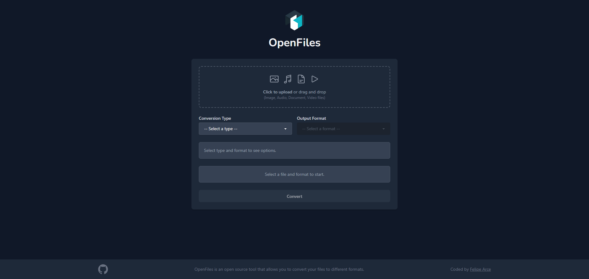

# 📂 OpenFiles: Web File Converter

[]()
[](https://openfilesconv.web.app)
[](LICENSE)

OpenFiles is a modern, open-source, and user-friendly web application for converting various file types directly in your browser. Upload your file, choose the desired output format, and download the result!

<p align="center">
   
</p>

## Key Features

- **Intuitive Interface:** Easily upload files via click or drag-and-drop.
- **Multiple Conversion Types:** Supports Images (JPG, PNG, WEBP, etc.), Audio (MP3, WAV, OGG, etc.), Video (MP4, WEBM, AVI, etc.), and Documents (Only DOCX to PDF (for now) via Gotenberg).
- **Format-Specific Options:** (Basic implementation) Potential to adjust parameters like image quality.
- **Cloud-Based Processing:** Conversions are efficiently handled using Firebase Cloud Functions and specialized backend services (like Gotenberg for documents).
- **Real-time Status:** Visualize the upload and conversion status (Uploading, Processing, Success, Error).
- **Direct Download:** Get the converted file with a single click.

## 📸 Screenshot



## 🛠️ Technologies Used

| Area          | Technology                                                                                                                                                                                     | Description                          |
| :------------ | :--------------------------------------------------------------------------------------------------------------------------------------------------------------------------------------------- | :----------------------------------- |
| **Frontend**  |  React                                                             | UI Library                           |
|               |  TypeScript                                         | Language for static typing           |
|               |  Vite                                                             | Build tool & Dev Server              |
|               |  Tailwind CSS | Utility-first CSS Framework          |
| **Backend**   |  Firebase                                                    | Platform (Cloud Functions, Storage)  |
|               |  Google Cloud Run                               | Hosting for Gotenberg container      |
|               |  Node.js                                                       | Functions Runtime Environment        |
|               |  TypeScript                                         | Language for Cloud Functions         |
| **Libraries** | `sharp`                                                                                                                                                                                        | Image Processing (in Function)       |
|               | `fluent-ffmpeg`                                                                                                                                                                                | Audio/Video Processing (in Function) |
|               | `axios`, `form-data`                                                                                                                                                                           | Calling Gotenberg API (in Function)  |
|               | `Gotenberg (Docker Image)`                                                                                                                                                                     | Document Conversion Service          |
|               | `daisyUI`                                                                                                                                                                                      | Tailwind CSS Component Library       |
|               | `Motion`                                                                                                                                                                                       | Animation Library (React/JS)         |

_(Icons courtesy of [Devicon](https://devicon.dev/))_

## 💻 Local Development Setup

**Prerequisites:**

- Node.js (v22 recommended - see [`backend/functions/package.json`](backend/functions/package.json)
- npm (comes with Node.js)
- Firebase CLI (`npm install -g firebase-tools` and `firebase login`)
- Google Cloud SDK (`gcloud`) - For deploying Gotenberg locally/to Cloud Run.
- Docker Desktop - To run Gotenberg locally.
- Java Development Kit (JDK) - Required by some Firebase Emulators.

**Steps:**

1.  **Clone the Repository:**

    ```bash
    git clone https://github.com/PipeZz/OpenFiles.git # Use your fork if contributing
    cd OpenFiles
    ```

2.  **Install Dependencies:**

    ```bash
    # Install frontend dependencies
    cd frontend
    npm install
    cd ..

    # Install backend dependencies
    cd backend/functions
    npm install
    cd ../..
    ```

3.  **Run Gotenberg Locally (Docker):**
    For document conversion during local development, you need a running Gotenberg instance. Start the Docker container:

    ```bash
    docker run --rm -p 3000:3000 gotenberg/gotenberg:7
    ```

    _(The `documentConverter` function expects it at `http://localhost:3000` by default)_

4.  **Start Firebase Emulators:**
    In a separate terminal, from the project root:

    ```bash
    firebase emulators:start --only functions,storage
    ```

    _(The Functions emulator will load the functions from `backend/functions/lib` - ensure they are built first with `npm run build --prefix backend/functions` if you make backend changes)_

5.  **Start Frontend (Vite):**
    In another terminal, from the project root:

    ```bash
    cd frontend
    npm run dev
    ```

    The application should now be available (usually `http://localhost:5173`) and connect to the local emulators and your local Gotenberg instance.

## ⚙️ Usage

1.  Open the application in your browser.
2.  Click the upload area or drag and drop a compatible file (Image, Audio, Video, Document).
3.  Select the desired conversion type and output format.
4.  Click the "Convert" button.
5.  Wait for the status indicator.
6.  Click the "Download" button upon success.

## ☁️ Backend Architecture

- **Firebase Cloud Functions:** Located in `backend/functions`, these are `onCall` HTTPS functions triggered by the frontend. Each handles a specific conversion type (image, audio, video, document).
- **Firebase Storage:** Used to temporarily store uploaded files (`uploads/`) and conversion results (`converted/`). Requires CORS configuration (`cors.json`) and security rules (`backend/storage.rules`).
- **Gotenberg (Document Conversion):**
  - **Local:** Runs as a Docker container on port 3000.
  - **Production:** Deployed as a separate service on Google Cloud Run. The `convertDocument` function finds its URL via the `GOTENBERG_API_URL` environment variable (set in [`firebase.json`](firebase.json) for deployment).
- **Firebase Emulators:** Used extensively for local development (`functions`, `storage`).

## 🤝 Contributing

Contributions are welcome! Please read the contribution guide in [`CONTRIBUTING.md`](CONTRIBUTING.md) for details on setting up, reporting issues, and submitting pull requests. Specific instructions for adding new conversion types are in [`docs/adding-converters.md`](mdc:docs/adding-converters.md).

## 📄 License

This project is licensed under the MIT License. See the [`LICENSE`](LICENSE) file for details.
